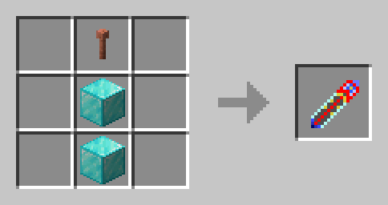
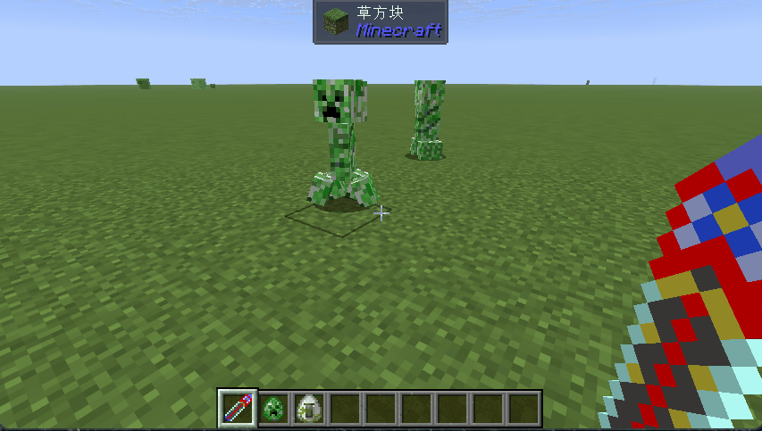
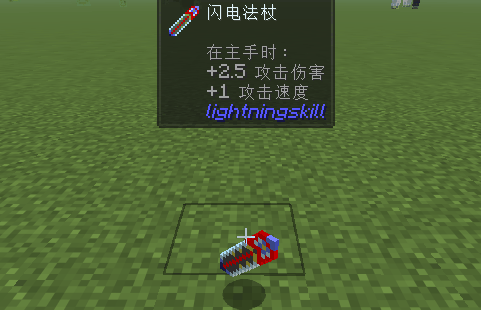

# Lightning Skill Mod（闪电技能模组）

## 模组简介

闪电技能模组是一个Minecraft Fabric模组，为玩家提供召唤闪电的力量。该模组添加了一把独特的**闪电法杖**，允许玩家通过左键攻击或右键点击在世界中召唤闪电。

---

## 功能介绍

### 闪电法杖（Lightning Staff）

闪电法杖是一把功能强大的工具，融合了钻石的坚固性与闪电的神秘力量。

#### 基础属性

| 属性     | 数值         |
| -------- | ------------ |
| 耐久度   | 455          |
| 挖掘效率 | 5.0          |
| 攻击速度 | 1.5          |
| 附魔能力 | 22           |
| 工具材料 | 下界合金级别 |

#### 核心功能

**1. 右键点击 - 召唤闪电**

当玩家对世界中的任意位置点击右键时，如果该位置与玩家的距离大于3.5格，闪电法杖将在该位置召唤一道闪电劈下。

- 有效攻击范围：大于3.5格
- 消耗：无需消耗耐久
- 适用场景：远程攻击、照明

**2. 左键攻击 - 闪电打击**

当玩家使用闪电法杖攻击实体（生物）时，闪电将在被攻击的实体位置立即召唤，对其造成闪电伤害。

- 有效攻击范围：大于2格
- 消耗：无需消耗耐久
- 适用场景：对敌对生物造成额外闪电伤害

---

## 合成配方

### 材料需求

| 材料                   | 数量 |
| ---------------------- | ---- |
| 避雷针 (Lightning Rod) | 1    |
| 钻石块 (Diamond Block) | 2    |

### 合成配方图示

  

## 修复材料

闪电法杖可以使用**钻石**或**自身**作为修复材料。

玩家可以将损坏的闪电法杖与钻石在工作台中组合进行修复，或使用铁砧进行修复。

> 修复标签：`lightningskill:repairs_lightning_gem`

---

## 演示效果

### 左键攻击效果

当玩家使用闪电法杖攻击生物时，闪电将在目标位置立即劈下：

  

### 右键点击效果

当玩家对远处位置右键点击时，闪电将在指定位置召唤：

  

---

## 物品展示

  

## 模组信息

- **模组ID**: lightningskill
- **命名空间**: cn.liukay
- **版本**: 1.0.0
- **前置要求**: Fabric API
- **游戏版本**: Minecraft 26.1

---

## 游戏环境说明

1. Minecraft 26.1
2. Fabric 0.19.1
3. 将本模组放入 `mods` 文件夹
4. 启动游戏并享受闪电的力量！

---

## 许可证

本模组采用 MIT 许可证开源。
